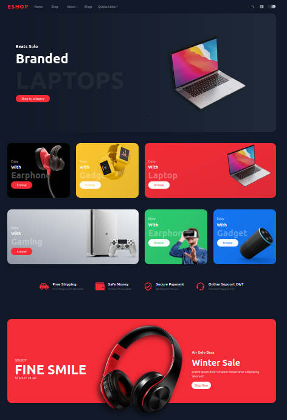
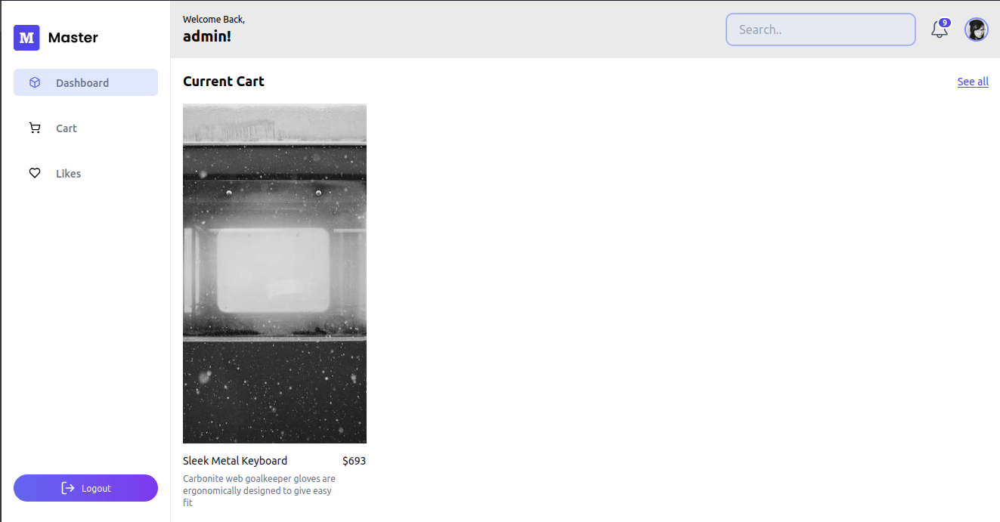
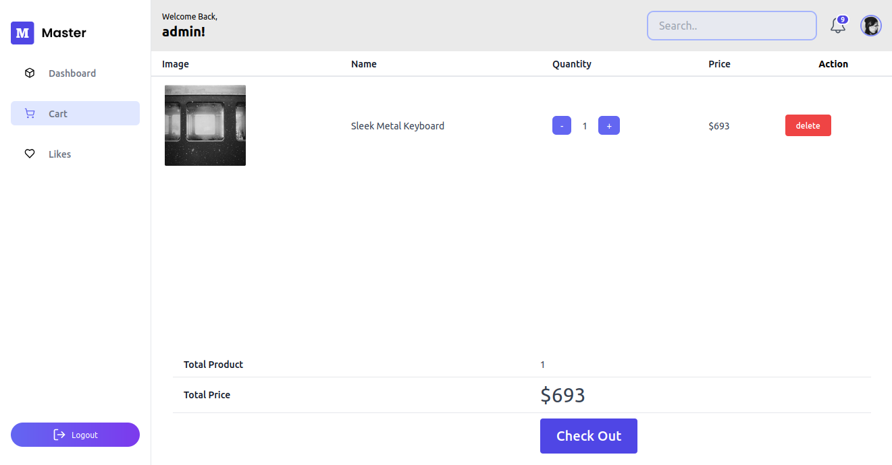
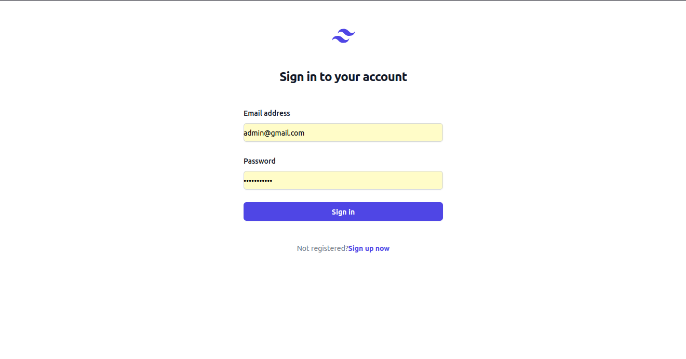
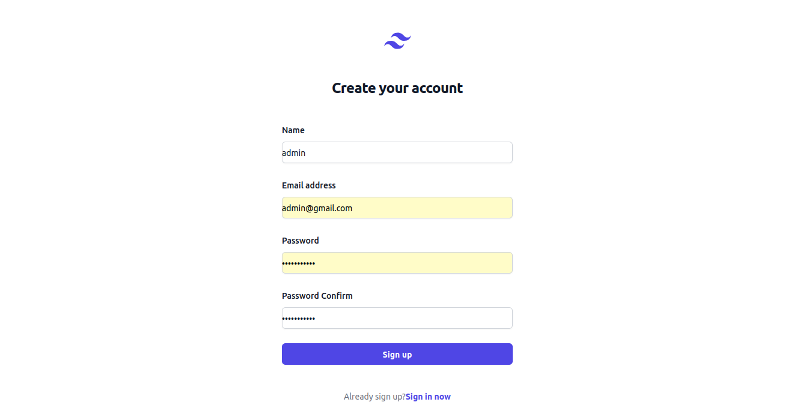
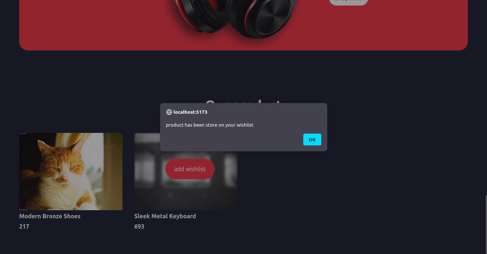
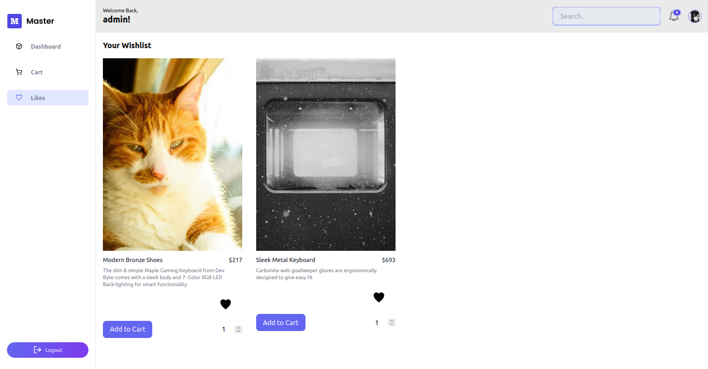

**E-commerce React JS PostgreSQL**

Proyek ini adalah sebuah aplikasi e-commerce yang dibangun menggunakan teknologi React JS, TailwindCSS,Express JS, Prisma ORM, dan PostgreSQL. Aplikasi ini menawarkan berbagai fitur yang membuat pengalaman belanja online menjadi lebih mudah dan menyenangkan.

**Fitur Utama**

1. **Tampilan Desain yang Menarik dan Responsive**: Aplikasi ini dirancang dengan menggunakan TailwindCSS untuk memberikan tampilan yang modern dan responsif.
2. **Dashboard untuk User**: Pengguna dapat mengakses dashboard mereka untuk melihat riwayat belanja, daftar keinginan, dan informasi akun.
3. **Tampilan Checkout pada Cart**: Setelah pengguna selesai memilih produk, mereka dapat mengatur quantity produk / menghapus produk yang disimpan di database dan melanjutkan ke proses checkout yang mudah dan aman.
4. **Authentication dan Authorization**: Aplikasi ini dilengkapi dengan sistem autentikasi dan otorisasi yang aman. Pengguna harus masuk atau mendaftar untuk mengakses fitur-fitur tertentu.
5. **Fitur Registrasi**: Pengguna dapat mendaftar dengan mudah dan cepat untuk mendapatkan akses ke fitur-fitur aplikasi.
6. **Add to Wishlist Product**: Pengguna dapat menambahkan produk ke wishlist belanja mereka dengan mudah. produk akan langsung disimpan di database wishlist produk.
7. **Wishlist Product**: Fitur ini memungkinkan pengguna untuk menambahkan produk ke daftar keinginan mereka yang sudah disimpan di database. dan pengguna dapat langsung memindahkan pesanan ke dalam cart.

**Gambar Fitur**

**Teknologi yang Digunakan**

- React JS untuk frontend
- TailwindCSS untuk styling
- Express JS untuk backend
- Prisma ORM untuk mengelola basis data
- PostgreSQL untuk basis data

**Kesimpulan**

Aplikasi e-commerce ini dirancang untuk memberikan pengalaman belanja online yang mudah dan menyenangkan. Dengan fitur-fitur yang lengkap dan tampilan yang menarik, aplikasi ini masih dalam proses pengembangan dan sedang dalam tahap testing / [WIP].
